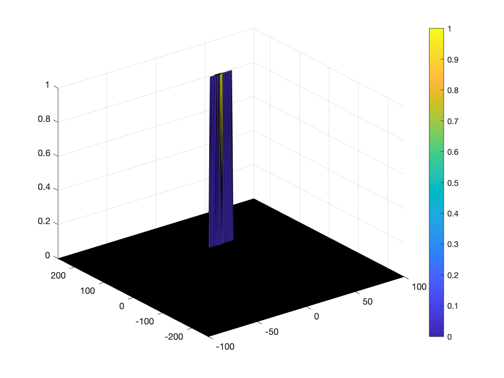

# Radar Target Generation and Detection

## Introduction

This project uses the following pipeline to first generate radar signals with regard to design specs. Then use 2D fft to get range and Doppler information. Finally a 2D CFAR technique is introduced to further remove unwanted noise.

    

## Implementation

### FMCW Waveform Design

The specifiction provided are:
```
Frequency of operation = 77GHz     
Max Range = 200m   
Range Resolution = 1m  
Max Velocity = 100 m/s
```

Additional information:
```
speed of light = 3e8
sweep_factor = 5.5
```

With the above information we can get:
```
Bw = c / (2 * dr)
Tchirp = sweep_factor * 2 * dmax / c
Slope = Bw/Tchirp
```

### Simulation Loop

In the simulation loop, we generate Tx and Rx signal by using the definitions below. Since the beat signal is the mix of Tx and Rx at a specific time epoch, we can obtain it by simply multiply Tx with Rx.
```
for i=1:length(t)         
    
    %For each time stamp update the Range of the Target for constant velocity.
    r_t(i) = init_range + v * t(i);
    td(i) = 2 * r_t(i)/c; % time delay is the round-trip time
    
    %For each time sample we need update the transmitted and
    %received signal. 
    Tx(i) = cos(2*pi*(fc*t(i)         + S*t(i)^2/2));
    Rx(i) = cos(2*pi*(fc*(t(i)-td(i)) + S*(t(i)-td(i))^2/2));
    
    %Now by mixing the Transmit and Receive generate the beat signal
    %This is done by element wise matrix multiplication of Transmit and
    %Receiver Signal
    Mix(i) = Tx(i) * Rx(i);
    
end
```

### Range FFT

Our initial range is set to 110m. From the simulation loop we can get the beat signal for every timestamp. With this data we can get range information by taking FFT to the beat signal.
```
rs_fft = fft(Mix, Nr);
rs_fft = rs_fft./Nr;
rs_fft = abs(rs_fft);
rs_fft = rs_fft(1:Nr/2);
```

The result is shown in the graph below. It's very close to our intial range.

  

### 2D CFAR

For 2D CFAR we set the training cell size and guard cell size for range and Doppler dimension as follow:

```
%Select the number of Training Cells in both the dimensions.
Tr = 12;
Td = 10;

%Select the number of Guard Cells in both dimensions around the Cell under 
%test (CUT) for accurate estimation
Gr = 4;
Gd = 4;
```

We use two loops to perform a 2D sliding window which scans through the range/Doppler fft map. First we extract all cells within the big rectangle determined by training cell in both dimensions and convert them from dB to linear unit. Then we remove guarding cells and CUT and get the average value of all training cells. Next we convert this average value back to dB and plus the offset to get our final threshold.

With the threshold value, we simply compare it with CUT. If CUT is greater then threshold then set the cell of current CUT to 1, else 0.

```
for i = 1:(Nr/2-2*(Tr+Gr))
    for j = 1:(Nd-2*(Td+Gd))
        % Extract training grids
        noise_level = db2pow(RDM(i:i+2*Tr+2*Gr, j:j+2*Td+2*Gd));

        % Set guarding cells and CUT to 0
        noise_level(Tr+1:end-Tr, Td+1:end-Td) = 0;
        
        % Calculate threshold by averaging the sum of training grids plus
        % offset
        thres = pow2db(sum(sum(noise_level))/training_grid_num) + offset;
        
        CUT = RDM(i+Tr+Gr, j+Td+Gd);
        
        if CUT > thres
            RDM(i+Tr+Gr, j+Td+Gd) = 1;
        else
            RDM(i+Tr+Gr, j+Td+Gd) = 0;
        end
    end
end
```

Lastly remove 4 edges that are not covered by the above workflow

```
RDM(1:end, 1:Td+Gd) = 0;
RDM(1:end, end-(Td+Gd):end) = 0;
RDM(1:Tr+Gr, Td+Gd:end-(Td+Gd)) = 0;
RDM(end-(Tr+Gr):end, Td+Gd:end-(Td+Gd)) = 0;
```

The result is shown as below:
  
